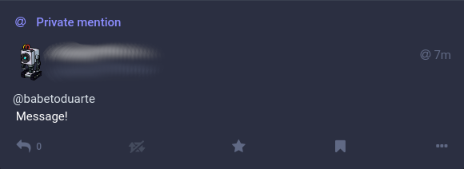
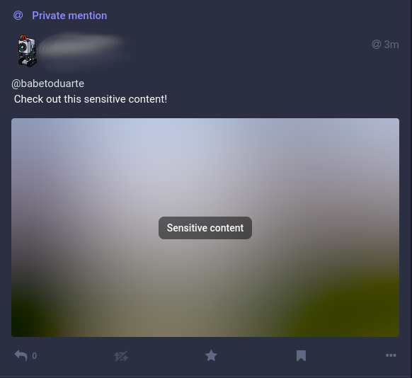
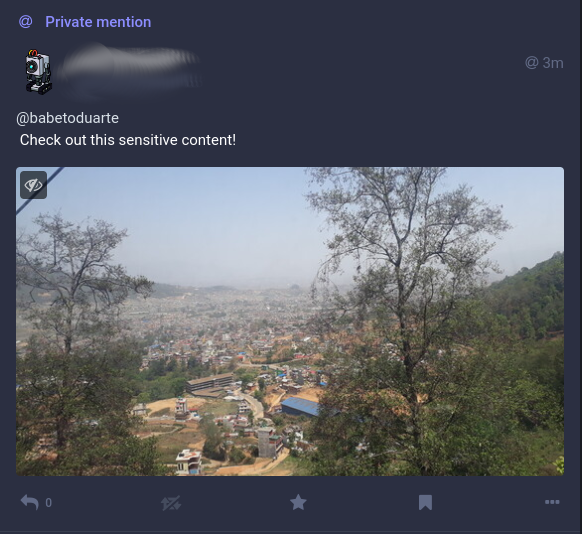
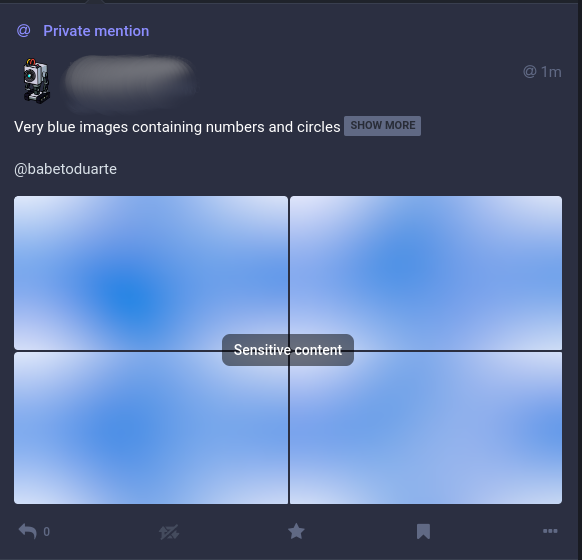
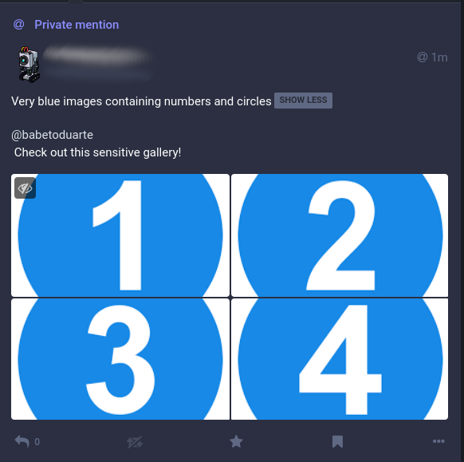

# TootNotify  

This is a python command line utility based on [Mastodon.py](https://github.com/halcy/Mastodon.py) , which is able to send direct messages to a given user on Mastodon:

`foo@bar:~$> tootnotify -r @user@instance -m "Message from TootNotify!"`

I built this tool to **notify myself via a secondary (bot) Mastodon account, when long-running processes and tasks finish**. FIY, **you don't need a second account to use TootNotify**, you can use your own account and DM yourself! Also, I'm sure there can be many more uses for this tool.


>Becasue of the way Mastodon works, direct messages are just regular *Toots* that mention a single user on the content of its body, and are set to have `private` visibility (only the accounts mentioned can see the *Toot*).

This tool allows to *attach* image, video and audio files to the direct message:

`foo@bar:~$> tootnotify -r @user@instance -m "Message with media" -f image1.png image2.jpg`
    
Due to mastodon's API specifications, media attached to posts must be of the same type: only images (up to 4 images per *Toot*), only video (a *single* video file __or GIF__), or only audio (a single *audio* file). **The current implementation allows the API to determine the MIME type of each media file by the media's extension**.

Note that these **attachments are done asynchronously** following Mastodon's guidelines, and the *Toot* is not sent until all data is uploaded (confirmed by the API call), which means your notification may take a few seconds to be sent while the attachments are uploaded. __If the upload takes more than the stipulated timeout parameter, the *Toot* is sent without any media__ (better to receive an incomplete notification than no notificatio at all!).

There are also command line arguments to flag your post as `sensitive content` (which will blur out the media you upload), as well as labeling the direct message with a `spoiler/content warning`, which will force the recipient to read your warning and click `Show More` to see the body and attachments of the message.

## Mastodon API

To use this tool you will need to have a Mastodon API application created, with its corresponding API credentials. 

The simplest way to do this, is through the Mastodon web interface: go to Preferences > Development (*i.e.* [mastodon.social/settings/applications](mastodon.social/settings/applications))


Once there, click on the `New Application` button. There, give your application a Name, and click the `Submit` button on the bottom of the page. Having created an App on your account, you should be presented with a `Client key`, a `Client secret`, and `Your Access Token`. You'll need to put these strings into a text configuration file called `.tootnotifyrc` located in your `$HOME` directory, as instructed below.
## Installation

This section presents the steps needed to install TootNotify, once the API credentials have been obtained.

### Create `~/.tootnotifyrc` file

TootNotify looks for API credentials stored as variables in the `~/.tootnotifyrc` file within the users `$HOME` folder. By default, **the `.tootnotifyrc` file is not shipped with the project, which means you need to create it**:

`foo@bar:~$> touch ~/.tootnotifyrc`

Make sure that the content of `~/.tootnotify` correspond to the following (and be sure to assign values to these variables **without any quotes**!):

``` shell
## FILE: ~/.tootnotifyrc
[tootnotify]
# Instance url (e.g. https://mastodon.social)
api_base_url = YOUR_INSTANCE_URL
# API Client Key
client_id = YOUR CLIENT_ID
# API Client Secret
client_secret = YOUR_CLIENT_SECRET
# API Access Token
access_token = YOU_ACCESS_TOKEN
# Default recipient for the private toots (e.g. @account@mastodon.social)
DEFAULT_RECIPIENT = YOUR_DEFAULT_RECIPIENT
```

Among the variables, a DEFAULT_RECIPIENT can be configured, so that when using TootNotify systematically to notify the same user, the recipient address doesn't have to be provided every time:

`foo@bar:~$> tootnotify -m "Message to the default recipient!"`

### Install via PIP

Once the `~/.tootnotifyrc` control file is in place, we can use PIP to install TootNotify (make sure you navigate to the root of the `TootNotify` project folder):

``` bash
foo@bar:TootNotify$> pip install .
```

We can check whether TootNotify was installed correctly, by invoking it (from anywhere) and passing it the `-h`/`--help` flag:

``` bash
foo@bar:~$> tootnotify -h
```

and if all goes well, we should be presented with the help dialog:

``` bash
usage: tootnotify [-h] [-r <@user@instan.ce>] [-m <message_body>] [-s <spoiler_description>]
                  [-f <path_to_media_file> [<path_to_media_file> ...]] [-x] [-t <timeout_in_seconds>] [-v] [--version]

Send a Direct Message to someone on Mastodon!

optional arguments:
  -h, --help            show this help message and exit
  -r <@user@instan.ce>, --recipient <@user@instan.ce>
                        User who will receive a direct message.
  -m <message_body>, --message <message_body>
                        Body of the message to be sent.
  -s <spoiler_description>, --spoiler <spoiler_description>
                        Description for the spoiler warning which hides the message.
  -f <path_to_media_file> [<path_to_media_file> ...], --files <path_to_media_file> [<path_to_media_file> ...]
                        List of up to 4 media files to attach to the message.
  -x, --sensitive       Flag post/media as sensitive content (blur media).
  -t <timeout_in_seconds>, --timeout <timeout_in_seconds>
                        Number of seconds to wait for a single media file to upload.
  -v, --verbose         Print out verbose messages.
  --version             show program's version number and exit
```

## Usage from the command line

This section presents several examples on how to use TootNotify from the command line once it has been installed.

### Toot to a single user

`foo@bar:~$> tootnotify -r @user@instance -m "Message!"`



### Toot with spoiler/content warning

`foo@bar:~$> tootnotify -r @user@instance -s "Movie spoiler" -m "I can't believe Jhon dies at the end of the movie!"`


### Toot and single media file

`foo@bar:~$> tootnotify -r @user@instance -m "Look at this animation!" -f animated.gif`


### Toot and multiple media files

`foo@bar:~$> tootnotify -r @user@instance -m "Nice image gallery!" -f image1.png image2.jpg image3.jpeg`


__If more than four media files are passed to `tootnotify -f` only the first four media files will be attached to the direct message.__

### Toot with 'sensitive' media

`foo@bar:~$> tootnotify -r @user@instance -m "Check out this sensitive content!" -f sensitive.png -x`





### Combining options

All these arguments can be used in combination with one another, meaning a *Toot* can: have a message body, have up to four images attached, have a spoiler/content warning, and be flagged as 'sensitive'!

`foo@bar:~$> tootnotify -r @usert@instance -m "Check out this sensitive gallery!" -f 1.png 2.png 3.png 4.png -s "Very blue images containing numbers and circles" -x`





### Toot to multiple users

This is an unintended use case, and it's sort of _hacky_, but you can add multiple recipients to the *Toot*, by adding multiple Mastodon handles with their respective instances as a `quoted string` passed to the `-r`/`--recipient` argument:

`foo@bar:~$> tootnotify -r "@user1@instance1 @user2@instance2" -m "Group Message!"`

## License Notice

TootNotify Copyright (C) 2023 Jorge A. Duarte
This program comes with ABSOLUTELY NO WARRANTY; for details see [LICENSE](LICENSE). This is free software, and you are welcome to redistribute it under certain conditions; see [LICENSE](LICENSE) for details.  

